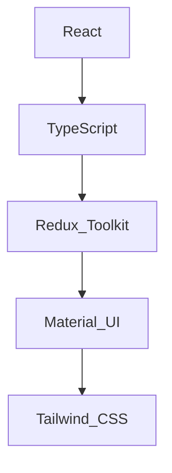

# 💻 About Me

Hi there! I'm **Mohammadreza Kalantari**, a passionate Front-End Developer and React enthusiast. I love crafting seamless and visually stunning web applications. My expertise lies in modern frameworks like React and TypeScript, focusing on performance, maintainability, and user-centric design.

---

## 🌟 Key Projects

### 1. [Dashplan](https://dashplan.ir)
- **Description:** A comprehensive platform for project management and productivity enhancement. 
- **Role:** Co-founder, contributing to its development and design from inception.
- **Technologies:** React, TypeScript, Redux Toolkit, Tailwind CSS

### 2. [Task Management Application](https://github.com/mkalantari96/Task-Management-Tools)
- **Description:** A robust tool for managing tasks with features like adding tasks, filtering by status, drag-and-drop reordering, and Material UI integration.
- **Live Demo:** [Task Management App](https://taskmanagementapp-kalantari.vercel.app/)
- **Technologies:** React, TypeScript, Redux Toolkit, Material UI, Vite

### 3. [VehiclesMapApp](https://github.com/mkalantari96/VehiclesMapApp)
- **Description:** A mapping application to display and filter vehicle data with location-based insights.
- **Technologies:** React, TypeScript, Redux Toolkit, React-Leaflet, Tailwind CSS

### 4. [Multi-Language Dashboard](https://github.com/mkalantari96/Multi-Language-Dashboard)
- **Description:** A powerful multi-language dashboard tailored for global users with a responsive and scalable design.
- **Live Demo:** [Multi-Language Dashboard](https://multi-language-dashboard.vercel.app/)
- **Technologies:** React, TypeScript, Redux Toolkit, i18n, Material UI

### 5. [Greendataware-AI](https://github.com/mkalantari96/greendataware-ai)
- **Description:** A platform designed for eco-conscious AI solutions. Includes dynamic event pages and a responsive, dark-themed design.

---

## 🎯 Skills

---

## 📊 Stats

---

## 🔗 Let's Connect

- **LinkedIn:** [Mohammadreza Kalantari](https://www.linkedin.com/in/mohammadreza-kalantari/)
- **Email:** m.kalantari75@gmail.com

---

## 🎨 Design Preferences

I love minimalist and modern designs, with a penchant for:
- Dark-themed UIs
- Clean typography
- Responsive layouts

---

## 🚀 Goals

- Enhance expertise in **Next.js** and **server-side rendering**.
- Contribute to impactful open-source projects.
- Collaborate on innovative startups and tech ideas.

---

Thank you for visiting my GitHub profile! Feel free to explore my repositories and get in touch for collaboration or just a chat about tech. 🚀

